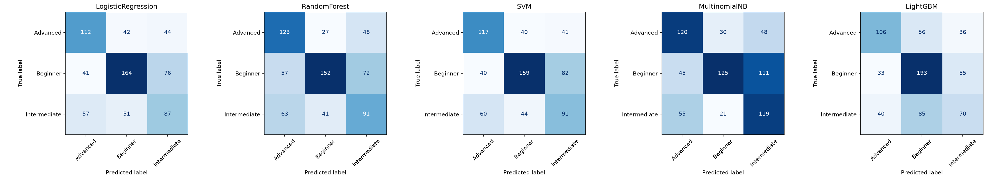
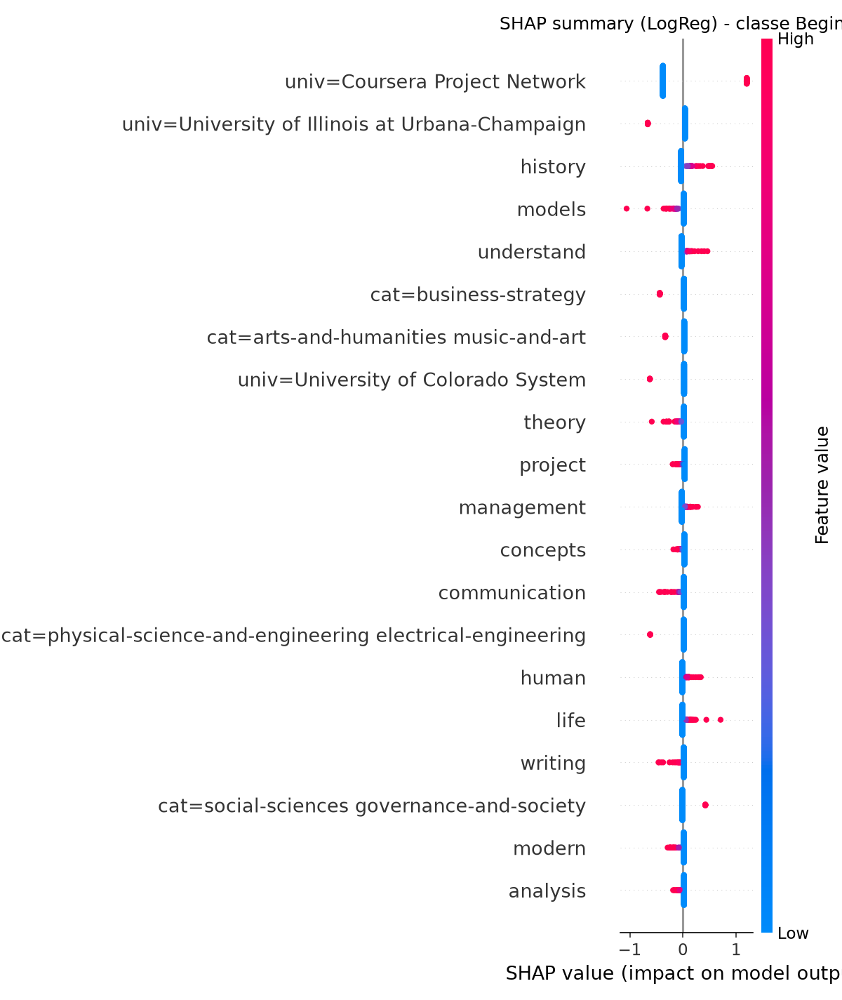
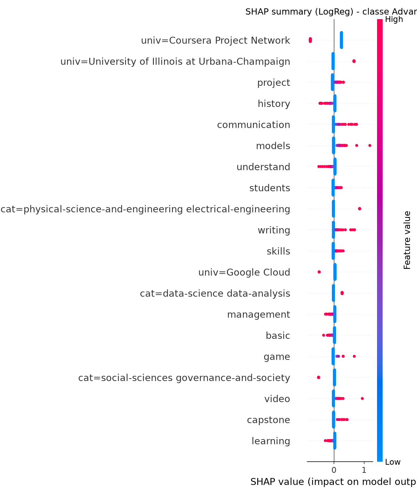

# ml-service — Prediction du niveau de difficulte d'un cours

Microservice Python (entrainement + FastAPI) qui predit le niveau de
difficulte (`Beginner` / `Intermediate` / `Advanced`) d'un cours Coursera a
partir de ses competences (Skills) et de sa description. Objectif : enrichir
le moteur de recommandation du module **Suivi & IA** (matcher le niveau du
cours au niveau de l'apprenant). Ce dossier est independant du code Java/
Spring Boot du reste du projet.

## 1. Dataset

- **Source** : `Coursera.csv` (fourni), 3522 lignes.
- **Colonnes** : `Course Name`, `University`, `Difficulty Level`,
  `Course Rating`, `Course URL`, `Course Description`, `Skills`.
- **Qualite des donnees / problemes rencontres** :
  - `Skills` est une chaine "sale" : competences individuelles separees par
    un **double espace**, avec des **tags de categorie Coursera** (ex.
    `data-science`, `arts-and-humanities`) colles a la fin sans separateur
    clair, reconnaissables par la presence d'un tiret.
  - `Course Rating` contient la valeur textuelle `"Not Calibrated"` au lieu
    d'un nombre (82 lignes sur le dataset deduplique) — cours trop recents
    ou pas assez notes pour avoir un score.
  - `Difficulty Level` contient deux valeurs qui ne sont pas de "vrais"
    niveaux comparables aux 3 principaux : `Not Calibrated` (50 lignes) et
    `Conversant` (186 lignes, surtout des cours de langues).
  - **106 doublons** de `Course Name` (memes cours references plusieurs
    fois).
  - Encodage : quelques caracteres mal decodes dans les textes (ex. `�`)
    issus du CSV source, non corriges car sans impact sur le TF-IDF
    (tokens rares, filtres par `min_df`).

## 2. Methodologie de pretraitement (Phase 1)

| Etape | Choix | Justification |
|---|---|---|
| Parsing `Skills` | Split sur double-espace -> competences ; tokens finaux avec tiret extraits vers une colonne `Category` | Format proprietaire Coursera, verifie manuellement sur plusieurs exemples |
| `Course Rating` | Conversion en float, `"Not Calibrated"` -> `NaN` (ligne conservee) | Le rating n'est pas utilise comme feature d'entrainement, pas de raison de supprimer la ligne |
| Doublons | `drop_duplicates` sur `Course Name`, garde la 1ere occurrence | Evite une fuite de donnees entre train/test sur des cours identiques |
| `Not Calibrated` (Difficulty) | **Exclu** (1.4% du dataset) | Ce n'est pas un niveau de difficulte mais un marqueur d'absence d'evaluation |
| `Conversant` (Difficulty) | **Fusionne avec `Intermediate`** (~5% du dataset) | Niveau reel (surtout cours de langues), semantiquement le plus proche d'`Intermediate` (connaissance de travail, ni debutant ni expert) ; l'exclure aurait perdu 5% des donnees, le garder seul aurait cree une 5e classe ultra-minoritaire |
| Features texte | TF-IDF sur `Skills` nettoyees + `Course Description`, `max_features=400`, unigrams+bigrams, `min_df=3`, stopwords anglais | Volume raisonnable pour rester interpretable en SHAP tout en couvrant l'essentiel du vocabulaire |
| `University` | One-hot sur le top 30 des universites les plus frequentes + `"Other"` | 184 universites uniques : un one-hot complet aurait explose la dimensionnalite pour un gain marginal |
| `Category` | One-hot sur les tags extraits (`NaN` -> `"Unknown"`) | Feature categorielle propre, cardinalite geree (54 valeurs) |
| Split | 80/20 stratifie sur `Difficulty Level` | Preserve la proportion des 3 classes dans train et test |

**Dataset final** : 3366 lignes (apres dedup + exclusion `Not Calibrated`),
481 features (400 TF-IDF + 31 University + 50 Category), classes finales :
Beginner 1401 (41.6%), Advanced 989 (29.4%), Intermediate 976 (29.0%).

Script : [`src/phase1_preprocessing.py`](src/phase1_preprocessing.py)

## 3. Comparaison des modeles (Phase 2-3)

4 algorithmes entraines avec validation croisee 5-fold (F1-macro) sur le
train, puis evalues sur le test (20% des donnees, jamais vu a
l'entrainement) :

| Modele | CV F1-macro (train) | Accuracy (test) | Precision macro | Recall macro | **F1 macro** | F1 weighted |
|---|---|---|---|---|---|---|
| MultinomialNB | 0.5157 ± 0.0096 | 0.5401 | 0.5612 | 0.5537 | **0.5415** | 0.5423 |
| SVM (linear) | 0.5273 ± 0.0185 | 0.5445 | 0.5396 | 0.5411 | 0.5386 | 0.5474 |
| RandomForest | 0.5271 ± 0.0121 | 0.5430 | 0.5428 | 0.5429 | 0.5376 | 0.5465 |
| LogisticRegression | 0.5207 ± 0.0202 | 0.5386 | 0.5306 | 0.5318 | 0.5305 | 0.5407 |
| LightGBM | 0.4986 ± 0.0243 | 0.5475 | 0.5349 | 0.5271 | 0.5277 | 0.5406 |

Les classes n'etant pas equilibrees (Beginner domine), le **F1-macro** est
le critere de decision retenu (plus robuste que l'accuracy). Tous les
modeles se situent dans une fourchette etroite (0.53-0.54), ce qui reflete
la difficulte intrinseque de la tache (chevauchement semantique fort entre
niveaux "Intermediate" et ses voisins).

Matrice de confusion des 5 modeles : 

Scripts : [`src/phase2_train_models.py`](src/phase2_train_models.py),
[`src/phase3_evaluation.py`](src/phase3_evaluation.py)

## 4. Analyse SHAP (Phase 4)

L'analyse SHAP a ete menee sur **deux** modeles pour arbitrer la decision
finale : le meilleur F1-macro brut (MultinomialNB) et son challenger le
plus proche en score (LogisticRegression).

- **MultinomialNB** (`KernelExplainer`, model-agnostic) : le top des
  features est domine par `University`/`Category` (ex.
  `univ=Coursera Project Network`, `cat=data-science machine-learning`) ;
  le texte (Skills/Description) est quasi absent des features les plus
  influentes.
- **LogisticRegression** (`LinearExplainer`, valeurs exactes) : **70 a
  80% du poids total** de la decision vient du texte (TF-IDF), avec des
  mots coherents pour distinguer les niveaux : *theory, models, understand,
  management, statistics, communication, writing*. `univ=Coursera Project
  Network` reste le signal individuel le plus fort mais c'est justifiable
  (ce fournisseur publie presque exclusivement des "Guided Projects" courts,
  systematiquement `Beginner`).




**Synthese** : cote MultinomialNB, la decision n'est pas vraiment
justifiable par le contenu du cours — un probleme pour un usage metier ou
l'on veut pouvoir dire "ce cours est Advanced parce qu'il mentionne X, Y,
Z". Cote LogisticRegression, la decision s'appuie majoritairement sur des
mots-cles plausibles, ce qui est **coherent avec l'intuition metier**
(termes plus techniques/abstraits -> niveaux plus avances) meme si le
signal reste bruite (F1-macro modeste).

Exemples d'explications individuelles (waterfall) :
[`reports/shap_logreg_waterfall_0.png`](reports/shap_logreg_waterfall_0.png),
[`reports/shap_logreg_waterfall_1.png`](reports/shap_logreg_waterfall_1.png),
[`reports/shap_logreg_waterfall_2.png`](reports/shap_logreg_waterfall_2.png).

Scripts : [`src/phase4_shap_analysis.py`](src/phase4_shap_analysis.py) (NB),
[`src/phase4b_shap_logreg.py`](src/phase4b_shap_logreg.py) (LogReg).

## 5. Modele champion (Phase 5)

**Champion retenu : Logistic Regression**, malgre un F1-macro legerement
inferieur au meilleur score brut (0.5305 vs 0.5415 pour MultinomialNB, un
ecart non significatif au vu des ecarts-types de validation croisee
~0.02).

**Pourquoi** :
- Performance quasi equivalente au meilleur modele.
- Decision **majoritairement fondee sur le contenu reel du cours**
  (Skills/Description), pas sur l'universite ou la categorie Coursera —
  essentiel pour un module qui doit *justifier* une recommandation.
- Modele lineaire = interpretation exacte et rapide (`LinearExplainer`,
  pas d'approximation), utile pour du monitoring/debug en production.

**Limites connues** :
- F1-macro ~0.53 : le modele capte un signal reel mais imparfait. Sur des
  exemples "evidents" manuellement testes, il se trompe encore
  regulierement (ex. un cours Python pour debutants absolus mal classe).
- La classe `Intermediate` reste la plus difficile a distinguer (frontiere
  floue avec `Beginner` et `Advanced`).
- `University`/`Category` ne sont pas disponibles a l'inference cote
  `suivi-service` (seulement Skills + Description) : ces features sont
  neutralisees (`"Other"` / `"Unknown"`) au moment de la prediction, ce qui
  reduit legerement le signal disponible par rapport a l'entrainement.
- **Recommandation d'usage** : utiliser `confidence`/`probabilities` comme
  signal d'appoint dans le moteur de recommandation, pas comme filtre
  strict.

Artefacts sauvegardes dans [`models/`](models/) :
`champion_model.joblib`, `tfidf_vectorizer.joblib`,
`university_encoder.joblib`, `category_encoder.joblib`,
`label_encoder.joblib`. Fonction de prediction reutilisable :
[`src/predict.py`](src/predict.py) (`predict_difficulty(skills_text,
description_text)`).

## 6. Integration dans l'architecture microservices (Phase 6)

```
                 ┌────────────────────┐
                 │   suivi-service     │  (Spring Boot, port 8083)
                 │  moteur de reco     │
                 └─────────┬───────────┘
                           │ POST /predict-difficulty (REST, JSON)
                           ▼
                 ┌────────────────────┐
                 │    ml-service        │  (FastAPI, port 8000)
                 │  modele LogisticReg  │
                 └────────────────────┘
```

`ml-service` est un service **Python autonome**, non enregistre dans Eureka
(il n'est pas un service Spring). `suivi-service` l'appelle via une URL
HTTP configurable (variable d'environnement, ex. `ml.service.url`) lorsqu'il
a besoin de connaitre le niveau de difficulte estime d'un cours pour le
matcher au niveau de l'apprenant dans ses recommandations.

Contrat REST detaille (requete/reponse JSON, sans code Java) :
[`INTEGRATION.md`](INTEGRATION.md).

Docker : [`Dockerfile`](Dockerfile) (image `python:3.12-slim`, utilisateur
non-root, `HEALTHCHECK`, n'embarque que les artefacts du champion — pas les
donnees brutes ni les modeles non retenus), coherent avec les Dockerfiles
multi-stage des autres services du projet (`devops/backend/*/Dockerfile`).

## 7. Reproduire l'entrainement depuis zero

```bash
cd ml-service

# 1. Environnement Python
python3 -m venv .venv
source .venv/bin/activate
pip install -r requirements.txt

# 2. Le dataset brut doit etre present dans data/Coursera.csv

# 3. Lancer les phases dans l'ordre (chaque script sauvegarde ses sorties
#    dans data/ et models/ pour la phase suivante)
python3 src/phase1_preprocessing.py     # nettoyage + features + split
python3 src/phase2_train_models.py      # entrainement des 5 modeles + CV
python3 src/phase3_evaluation.py        # metriques test + matrices de confusion
python3 src/phase4_shap_analysis.py     # SHAP sur MultinomialNB
python3 src/phase4b_shap_logreg.py      # SHAP sur LogisticRegression
python3 src/phase5_finalize.py          # fige le modele champion (models/champion_model.joblib)

# 4. Verifier le rechargement des artefacts hors notebook
python3 src/predict.py

# 5. Lancer le microservice en local
pip install -r requirements-service.txt
uvicorn app.main:app --host 0.0.0.0 --port 8000
# -> GET  http://localhost:8000/health
# -> POST http://localhost:8000/predict-difficulty

# 6. Ou via Docker
docker build -t ml-service .
docker run -p 8000:8000 ml-service
```
