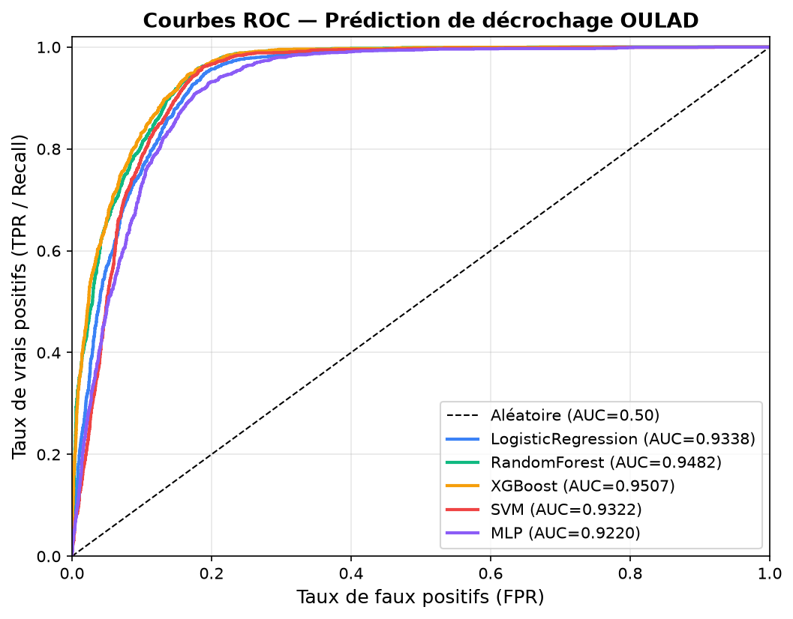
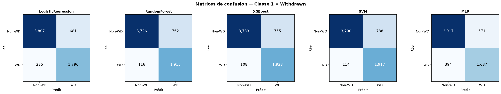
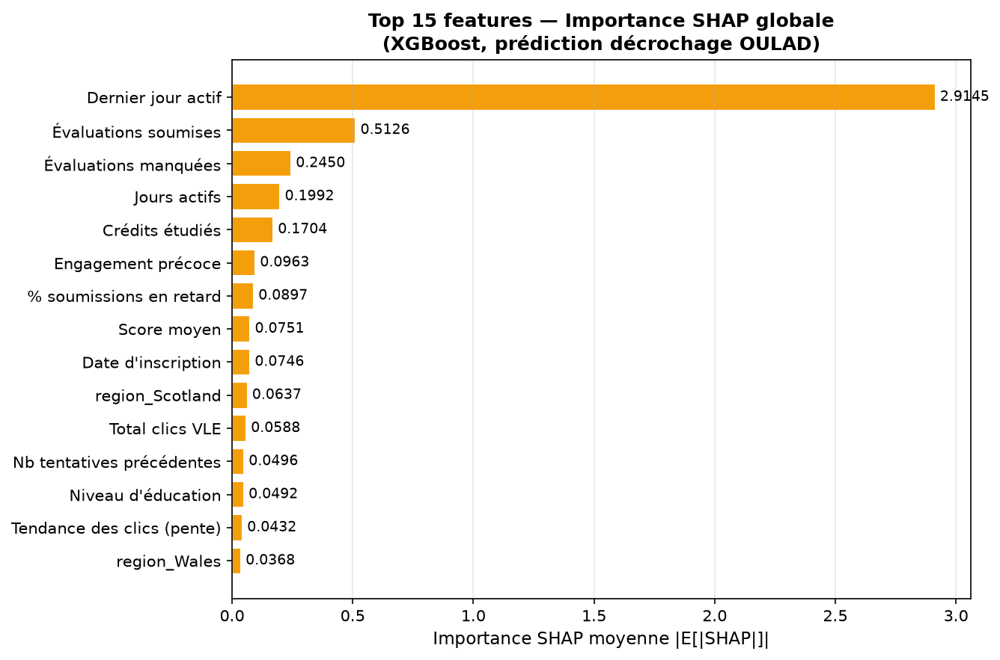
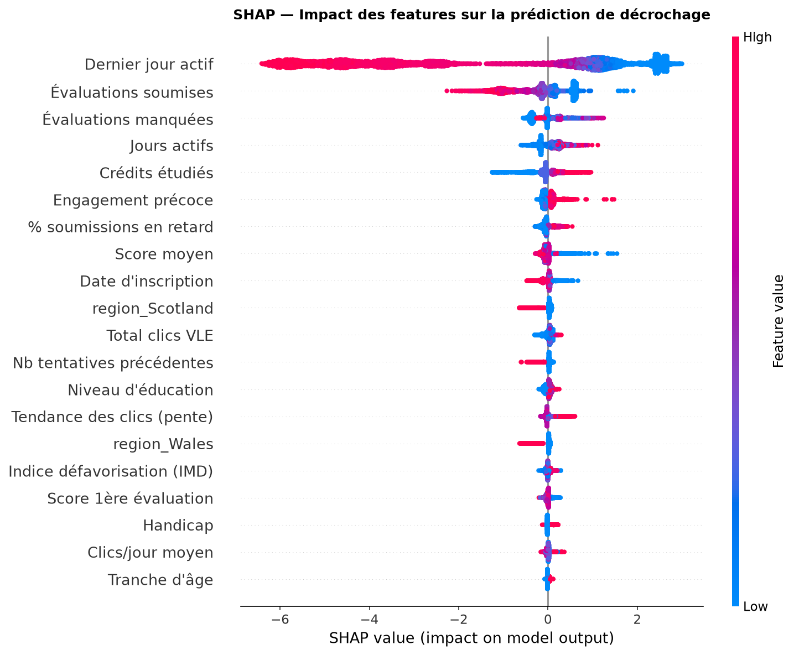

# ml-service — Prediction du niveau de difficulte et du risque de decrochage

Microservice Python (entrainement + FastAPI) exposant **deux modeles de prediction** :

| Modele | Dataset | Algorithme | Endpoint |
|---|---|---|---|
| Niveau de difficulte | Coursera (3 522 cours) | Logistic Regression | `POST /predict-difficulty` |
| Risque de decrochage | OULAD (32 593 inscriptions) | XGBoost | `POST /predict-dropout` |

Objectif : enrichir le module **Suivi & IA** de la plateforme — (1) matcher le niveau du cours
au niveau de l'apprenant, (2) alerter le formateur sur les apprenants en danger de decrochage.

---

## Modele 1 — Niveau de difficulte de cours (Coursera)

### 1.1 Dataset

- **Source** : `Coursera.csv` (fourni), 3 522 lignes.
- **Colonnes** : `Course Name`, `University`, `Difficulty Level`, `Course Rating`, `Course Description`, `Skills`.
- **Problemes de qualite rencontres** :
  - `Skills` : format proprietaire (double-espace separateur, tags de categorie avec tiret colles a la fin).
  - `Course Rating` : valeur textuelle `"Not Calibrated"` sur 82 lignes.
  - `Difficulty Level` : valeurs hors-classe `Not Calibrated` (50 lignes) et `Conversant` (186 lignes).
  - 106 doublons de `Course Name`.

### 1.2 Feature Engineering

| Etape | Choix | Justification |
|---|---|---|
| Parsing Skills | Split sur double-espace ; tags a tiret → colonne `Category` | Format Coursera verifie manuellement |
| Not Calibrated (Difficulty) | Exclu (1.4%) | Pas un niveau, marqueur d'absence d'evaluation |
| Conversant | Fusionne avec Intermediate | Semantiquement proche, evite une 5e classe ultra-minoritaire |
| Features texte | TF-IDF (400 features, 1-2grams, min_df=3) sur Skills + Description | Couvre le vocabulaire utile sans explosion dimensionnelle |
| University | One-hot top 30 + "Other" | 184 universites uniques → cardinalite geree |
| Category | One-hot (54 valeurs + "Unknown") | Feature propre a faible cardinalite |
| Split | 80/20 stratifie sur Difficulty Level | Preserve les proportions des 3 classes |

**Dataset final** : 3 366 lignes, 481 features (400 TF-IDF + 31 University + 50 Category).
Classes : Beginner 41.6%, Advanced 29.4%, Intermediate 29.0%.

### 1.3 Comparaison des modeles

| Modele | CV F1-macro | Accuracy | F1-macro (test) |
|---|---|---|---|
| MultinomialNB | 0.5157 ± 0.010 | 0.5401 | 0.5415 |
| SVM (linear) | 0.5273 ± 0.019 | 0.5445 | 0.5386 |
| RandomForest | 0.5271 ± 0.012 | 0.5430 | 0.5376 |
| LogisticRegression | 0.5207 ± 0.020 | 0.5386 | 0.5305 |
| LightGBM | 0.4986 ± 0.024 | 0.5475 | 0.5277 |

### 1.4 Modele champion : LogisticRegression

MultinomialNB a le meilleur F1-macro brut mais son analyse SHAP revele que la decision est
pilotee par `University`/`Category`, pas par le contenu textuel du cours — non justifiable
metier. LogisticRegression base **70-80% de sa decision sur le texte (TF-IDF)**, termes
coherents avec l'intuition : *theory, management, statistics, communication* pour les niveaux
avances, *introduction, basics, fundamentals* pour Beginner.

Artefacts : `models/champion_model.joblib` + encoders. Fonction : `src/predict.py`.

### 1.5 Limites

- F1-macro ~0.53 : signal reel mais bruite, chevauchement semantique fort entre Intermediate et ses voisins.
- University/Category non disponibles a l'inference (neutralises par "Other"/"Unknown").
- Usage recommande : signal d'appoint, pas filtre strict.

---

## Modele 2 — Prediction du risque de decrochage (OULAD)

### 2.1 Dataset

- **Source** : [Open University Learning Analytics Dataset (OULAD)](https://www.kaggle.com/datasets/anlgrbz/student-demographics-online-education-dataoulad) — Kaggle
- **7 tables** joinables par `id_student + code_module + code_presentation`

| Table | Lignes | Contenu |
|---|---|---|
| studentInfo | 32 593 | Table centrale — profil + resultat final |
| studentRegistration | 32 593 | Dates d'inscription et de desinscription |
| studentAssessment | 173 912 | Resultats de chaque evaluation soumise |
| studentVle | 10 655 280 | Logs de clics par jour par ressource |
| vle | 6 364 | Catalogue des ressources (type, semaine) |
| courses | 22 | Duree de chaque module x presentation |
| assessments | 206 | Catalogue des evaluations (deadline, poids) |

**Variable cible** : binaire — `Withdrawn = 1` (31.2%) vs `Non-withdrawn = 0` (68.8%).
Desiquilibre modere (ratio 1:2.2), gere par `class_weight='balanced'`.

**Justification de la cible** : on detecte l'abandon, pas la performance — un apprenant qui
echoue a au moins termine son parcours ; un decrocheur prive le formateur de tout feedback.

### 2.2 Feature Engineering (32 features)

#### Depuis studentVle (comportement sur la plateforme)

| Feature | Description |
|---|---|
| `total_clicks` | Nombre total de clics sur la plateforme |
| `nb_active_days` | Nombre de jours avec au moins 1 clic |
| `avg_clicks_per_day` | Moyenne de clics par jour actif |
| `last_active_day` | Dernier jour d'activite (relatif au debut du cours) |
| `days_before_start_activity` | Nb de jours d'engagement avant le debut officiel |
| `click_trend` | Pente de regression lineaire des clics hebdomadaires (negatif = declin) |
| `nb_resource_types` | Diversite des types de ressources consultees |

#### Depuis studentAssessment (evaluations)

| Feature | Description |
|---|---|
| `nb_assessments_submitted` | Nombre d'evaluations soumises |
| `avg_score` | Score moyen aux evaluations (0-100) |
| `pct_late_submissions` | Proportion de soumissions en retard |
| `first_assessment_score` | Score a la premiere evaluation (indicateur precoce) |
| `nb_missing_assessments` | Evaluations planifiees non soumises du tout |

#### Depuis studentInfo (profil demographique)

`studied_credits`, `num_of_prev_attempts`, `age_band_enc`, `highest_education_enc`,
`imd_band_enc`, `gender_enc`, `disability_enc`, + 12 dummies region.

#### Depuis studentRegistration

`date_registration` (jours avant/apres le debut du cours).
`date_unregistration` **exclue** : fuite de donnees (un apprenant qui se desinscrit
est par definition un decrocheur — inclure cette feature reviendrait a tricher).

### 2.3 Preprocessing

| Etape | Choix |
|---|---|
| Valeurs manquantes | 0 pour les features VLE/assessment absentes ; mediane pour avg_score et first_assessment_score |
| imd_band | 3.41% manquants → mediane |
| Scaling | StandardScaler (fit sur train uniquement) |
| Desiquilibre | SMOTE compare a class_weight='balanced' pour chaque modele ; la meilleure variante retenue |
| Split | 80/20 stratifie (train : 26 074, test : 6 519) |

### 2.4 Comparaison des modeles

| Modele | Recall Withdrawn | Precision Withdrawn | F1 Withdrawn | AUC-ROC | Variante |
|---|---|---|---|---|---|
| **XGBoost** | **0.9468** | 0.7181 | **0.8167** | **0.9507** | class_weight |
| SVM (RBF) | 0.9439 | 0.7087 | 0.8095 | 0.9322 | class_weight |
| Random Forest | 0.9429 | 0.7154 | 0.8135 | 0.9482 | class_weight |
| Logistic Regression | 0.8843 | 0.7251 | 0.7968 | 0.9338 | class_weight |
| MLP (256-128-64) | 0.8060 | 0.7414 | 0.7724 | 0.9220 | SMOTE |

**Critere de selection** : recall de la classe Withdrawn — mieux vaut signaler
un faux positif (formateur verifie inutilement) que rater un vrai decrocheur.

Courbes ROC : 

Matrices de confusion : 

### 2.5 Modele champion : XGBoost

- **1 923 / 2 031 decrocheurs detectes** sur le test set (94.7% recall)
- **108 decrocheurs manques** (5.3%)
- 755 faux positifs (alertes inutiles) sur 4 488 non-decrocheurs (16.8%)
- AUC = 0.9507 (separation quasi-parfaite)
- Hyperparametres : `n_estimators=200, max_depth=4, learning_rate=0.05, subsample=1.0, scale_pos_weight=ratio`

### 2.6 Analyse SHAP (XGBoost, TreeExplainer)





#### Top 15 features par importance SHAP

| Rang | Feature | SHAP moyen | Interpretation |
|---|---|---|---|
| 1 | Dernier jour actif | **2.9145** | Signal dominant — arret precoce = quasi-certain decrochage |
| 2 | Evaluations soumises | 0.5126 | Ne pas rendre ses devoirs = alarme forte |
| 3 | Evaluations manquees | 0.2450 | Manquer totalement > soumettre en retard |
| 4 | Jours actifs | 0.1992 | La regularite de connexion > l'intensite |
| 5 | Credits etudies | 0.1704 | Surcharge de credits = facteur de risque |
| 6 | Engagement precoce | 0.0963 | Commencer avant le debut du cours est protecteur |
| 7 | % soumissions en retard | 0.0897 | Signal precoce de desengagement progressif |
| 8 | Score moyen | 0.0751 | Impact modere — pas le seul determinant |
| 9 | Date d'inscription | 0.0746 | S'inscrire tard = risque accru |
| 10 | Total clics VLE | 0.0588 | Volume global d'engagement |

**Conclusion metier : "Le QUOI FAIRE prime sur le QUI EST"** — les features
comportementales VLE dominent (7/10 premieres), les features demographiques
(age, genre, region) ont peu d'impact. Ce resultat est coherent avec
l'intuition pedagogique et **actionnable** : un formateur peut intervenir
sur l'engagement, pas sur le profil de l'apprenant.

### 2.7 Limites

- **Fuite temporelle potentielle** : les features VLE et assessment utilisent
  toute la periode du cours, y compris des jours posterieurs au decrochage.
  En production reelle, il faudrait limiter aux N premieres semaines (ex. 3-4
  semaines) pour une prediction vraiment preventive. Pour ce TP, la limitation
  est mentionnee mais non implementee.
- **Transferabilite** : le modele est entraine sur les modules de l'Open University
  UK (7 modules, contexte enseignement superieur a distance). Les performances
  peuvent varier sur d'autres plateformes ou types de cours.
- **Desequilibre residuel** : 31/69% — gere par class_weight mais un changement
  de distribution en production peut degrader les performances.
- **Region Ecosse/Pays de Galles** : signal inattendu dans le top 15 (SHAP ~0.06)
  — probablement lie a des differences structurelles dans les modules proposes
  dans ces regions, a investiguer.

---

## Architecture microservices

```
┌─────────────────────────────────────────────────────────────────┐
│                      Angular Frontend                           │
│  - Onglet "Mon niveau" : compatibilite cours/apprenant         │
│  - Dashboard formateur : apprenants a risque (a implementer)   │
└──────────────────┬─────────────────────────┬────────────────────┘
                   │                         │
                   ▼                         ▼
     ┌─────────────────────────┐  ┌─────────────────────────┐
     │     api-gateway          │  │     api-gateway          │
     │  (Spring Cloud MVC)      │  │  (Spring Cloud MVC)      │
     └──────────┬──────────────┘  └───────────┬─────────────┘
                │ /api/recommendation/**        │ (futur)
                ▼                              ▼
     ┌─────────────────────────┐  ┌─────────────────────────┐
     │    suivi-service         │  │  suivi-service           │
     │   (Spring Boot 4.0.3)    │  │  (Spring Boot 4.0.3)     │
     │  MlServiceClient         │  │  (a connecter)           │
     └──────────┬──────────────┘  └───────────┬─────────────┘
                │ POST /predict-difficulty      │ POST /predict-dropout
                ▼                              ▼
     ┌──────────────────────────────────────────────────────┐
     │                  ml-service (FastAPI, port 8000)      │
     │   /predict-difficulty  →  LogisticRegression          │
     │   /predict-dropout     →  XGBoost                     │
     │   /health                                             │
     └──────────────────────────────────────────────────────┘
```

`ml-service` est **non enregistre dans Eureka** (service Python autonome).
`suivi-service` l'appelle via URL configurable (`ml.service.url`).

---

## Reproduire l'entrainement depuis zero

```bash
cd ml-service

# 1. Environnement Python
python3 -m venv .venv && source .venv/bin/activate
pip install -r requirements.txt
pip install imbalanced-learn xgboost

# 2. Datasets
#    - data/Coursera.csv (fourni)
#    - data/oulad/ : 7 CSV depuis https://www.kaggle.com/datasets/anlgrbz/student-demographics-online-education-dataoulad

# === Modele 1 : Difficulty Level (Coursera) ===
python src/phase1_preprocessing.py
python src/phase2_train_models.py
python src/phase3_evaluation.py
python src/phase4_shap_analysis.py
python src/phase4b_shap_logreg.py
python src/phase5_finalize.py

# === Modele 2 : Dropout (OULAD) ===
python src/oulad_phase1_exploration.py
python src/oulad_phase2_features.py
python src/oulad_phase3_preprocessing.py
python src/oulad_phase4_train.py
python src/oulad_phase5_evaluation.py
python src/oulad_phase6_shap.py
python src/oulad_phase7_finalize.py

# === Lancer le microservice ===
pip install -r requirements-service.txt
uvicorn app.main:app --host 0.0.0.0 --port 8000

# Tests
curl http://localhost:8000/health
curl -X POST http://localhost:8000/predict-difficulty \
  -H "Content-Type: application/json" \
  -d '{"skills":"python data structures algorithms","description":"Advanced course for experienced developers"}'

curl -X POST http://localhost:8000/predict-dropout \
  -H "Content-Type: application/json" \
  -d '{"total_clicks":12,"nb_active_days":3,"last_active_day":8,"nb_assessments_submitted":0,"nb_missing_assessments":4}'

# === Via Docker ===
docker build -t ml-service .
docker run -p 8000:8000 ml-service
```

---

## Contrat REST complet

Voir [`INTEGRATION.md`](INTEGRATION.md) pour le detail des requetes/reponses JSON.

| Methode | Route | Corps | Reponse cle |
|---|---|---|---|
| GET | `/health` | — | `{"status":"ok","models":["difficulty","dropout"]}` |
| POST | `/predict-difficulty` | `{skills, description}` | `{difficulty, confidence, probabilities, top_features}` |
| POST | `/predict-dropout` | `{total_clicks, nb_active_days, last_active_day, ...}` | `{will_dropout, dropout_probability, risk_level, top_risk_factors}` |
| GET | `/predict-dropout/health` | — | `{"status":"ok","model":"XGBoost"}` |
